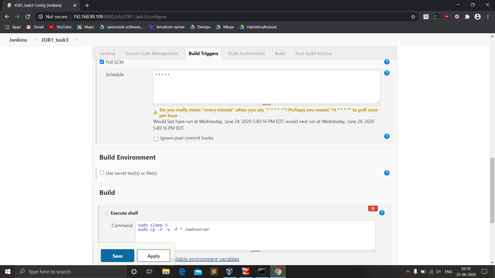

# <div align="center"> Under Guidence of </div>
# <div align="center"> ░V░i░m░a░l░ ░D░a░g░a░ </div><br>
### Automation-project using Kubernetes
#### Task Description
 - Create container image that’s has Jenkins installed  using dockerfile  Or You can use the Jenkins Server on RHEL 8/7
 - When we launch this image, it should automatically starts Jenkins service in the container.
 - Create a job chain of job1, job2, job3 and  job4 using build pipeline plugin in Jenkins 
 - Job1 : Pull  the Github repo automatically when some developers push repo to Github.
 - Job2 : 
    1. By looking at the code or program file, Jenkins should automatically start the respective language interpreter installed image container to deploy code on top of Kubernetes 
    2.  Expose your pod so that testing team could perform the testing on the pod
    3. Make the data to remain persistent ( If server collects some data like logs, other user information )
 - Job3 : Test your app if it  is working or not.
 - Job4 : If app is not working , then send email to developer with error messages and redeploy the application after code is being edited by the developer


#### >>> ` I have made a Build Pipeline for Monitoring :` <br><br>
<br><br>
 
- Here I've used `POLL SCM` to perform the task.
- As the developer commits the codes, Jenkins automatically triggers the jobs and do certain tasks.<br><br>
### JOB_1 : 
#### >>>`Pull  the Github repo automatically when some developers push repo to Github`<br><br>
<br><br>
### JOB_2 : <br>
```
1. By looking at the code or program file, Jenkins should automatically start the respective language interpreter 
   installed image container to deploy code on top of Kubernetes.
2. Expose your pod so that testing team could perform the testing on the pod
3. Make the data to remain persistent ( If server collects some data like logs, other user information )
``` 
<br><br>
<br><br>
### JOB_3 : 
#### >>>`Test your app if it  is working or not`<br><br>
<br><br>
### JOB_4 : 
#### >>>`If app is not working, then send email to developer with error messages and redeploy the application` <br> `after code is being edited by the developer`<br><br>
<br><br>


##### Thank You Vimal Sir for this Intresting Task
